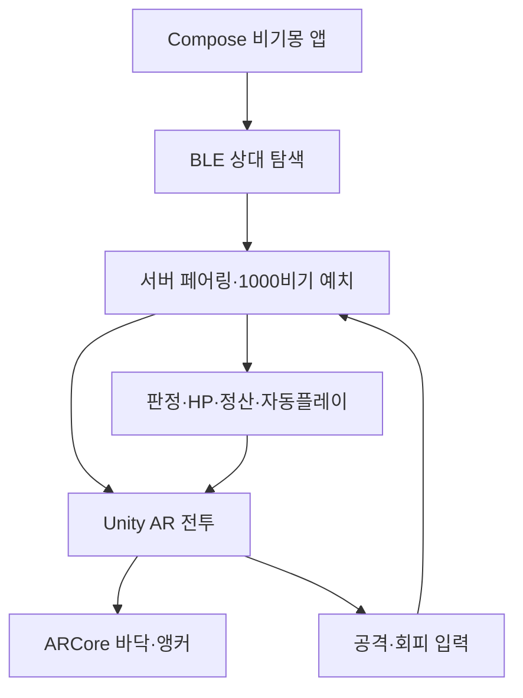

# 비기몽 AR 근거리 대전 설계 v0.8

## 확정 구조

기존 Kotlin·Compose 앱은 계정, 걸음, 알림, BLE 탐색, 서버 통신을 담당한다. Unity는 `Unity as a Library` 방식의 전체화면 AR 전투 화면만 담당한다. AR Foundation은 Android에서 ARCore Provider를 사용한다.

BLE는 근처 상대를 찾고 일회성 `pairingCode`를 교환하는 용도다. 배팅, 방향 선택, 피해, 승패, 20% 소각은 서버가 확정한다. P2P 데이터만으로 코인을 정산하면 변조가 쉬우므로 허용하지 않는다.

## AR 전투 흐름

1. 방을 연 기기가 8자리 BLE 페어링 코드를 광고한다.
2. 상대 기기가 같은 서비스 UUID를 탐색해 코드를 읽는다.
3. 두 기기가 각각 `NEARBY`, 1,000비기, 동일 코드를 서버에 제출한다.
4. 서버는 동일 코드의 두 사용자만 매칭하고 양쪽 비기를 선예치한다.
5. Android가 `battleId`, 양쪽 `artId`, 성장 단계, HP, 서버 마감시각을 Unity에 전달한다.
6. Unity에서 카메라가 켜지고 사용자가 인식된 바닥을 눌러 링을 배치한다.
7. 양쪽 캐릭터가 같은 서버 전투 상태를 재생한다. Cloud Anchor가 연결된 경우 실제 공간의 같은 위치에 배치한다.
8. 각 라운드는 서버 기준 10초다. 미선택·BLE 유실·앱 통신 지연이 발생하면 서버가 자동 방향을 선택한다.
9. 재접속하면 최신 스냅샷을 받아 HP와 라운드부터 복구한다.

## 진화 단계 실제 크기

| 서버 단계 | 표시 | 목표 높이 |
|---|---|---:|
| `GROWTH` | 성장기/아동기 | 0.30m |
| `YOUTH` | 청년기 | 0.90m |
| `ADULT` | 성인기 | 2.10m |

모델의 Renderer 전체 Bounds 높이를 측정해 목표 미터 높이에 맞게 자동 배율을 계산한다. 두 성체가 싸울 때는 캐릭터 간 거리와 링 크기도 함께 확대한다.

## 캐릭터 애니메이션 계약

90개 프리팹은 동일한 Animator Trigger 이름을 제공하되 실제 클립은 30종과 성장 단계마다 다르게 만든다.

| Trigger | 동작 |
|---|---|
| `Attack_Left` | 왼쪽 방향 고유 공격 |
| `Attack_Center` | 중앙 방향 고유 공격 |
| `Attack_Right` | 오른쪽 방향 고유 공격 |
| `Dodge_Left` | 왼쪽 고유 회피 |
| `Dodge_Center` | 중앙 고유 회피 |
| `Dodge_Right` | 오른쪽 고유 회피 |
| `Hit` | 피격·넉백 |
| `KO` | HP 0 쓰러짐 |
| `Victory` | 승리 포즈 |

서버의 모션 키는 어떤 종·단계·행동인지 선택하며, 프리팹별 Animator Controller가 고유 움직임을 재생한다.

## 같은 실제 위치에 보이게 하는 방법

BLE는 두 기기의 좌표계를 정렬하지 못한다. `SharedAnchorProvider` 경계에 ARCore Extensions Cloud Anchors를 연결해 호스트가 생성한 Cloud Anchor ID를 서버를 통해 상대에게 전달해야 한다. Cloud Anchor가 준비되지 않았거나 인터넷이 불안정하면 각 기기가 자기 바닥에 링을 놓되 전투 결과와 애니메이션 시점은 동일하게 유지한다.

## 트래킹·기기 예외 처리

- 바닥을 놓치면 마지막 링과 캐릭터 위치를 유지하고 트래킹 유실 패널을 표시한다.
- 1.5초 이상 추적이 복구되지 않으면 `앵커 다시 잡기`를 제공한다.
- ARCore 미지원 단말기는 Compose 2D 대전 화면을 유지한다.
- 카메라 권한 거절 시 일반 대전으로 되돌아간다.
- BLE 권한은 근거리 대전에서만 요청한다. Android 12 이상은 Scan/Connect/Advertise, 이전 버전은 위치 권한을 사용한다.

## 공식 기술 기준

- Unity 6 Unity as a Library: https://docs.unity3d.com/6000.0/Documentation/Manual/UnityasaLibrary-Android.html
- AR Foundation 6.1: https://docs.unity3d.com/Packages/com.unity.xr.arfoundation@6.1/manual/index.html
- ARCore Cloud Anchors: https://developers.google.com/ar/develop/cloud-anchors
- Android Bluetooth 권한: https://developer.android.com/develop/connectivity/bluetooth/bt-permissions

## 아직 필요한 제작 자산

- 현재 2D 렌더를 기반으로 한 90개 리깅 3D 모델 또는 최적화된 단계별 프리팹
- 종·단계별 공격 3개, 회피 3개, 피격, KO, 승리 애니메이션
- 링, 소환, 그림자, 화염·돌진·할퀴기·먼지·코인 파티클
- 모바일 기준 LOD, 텍스처 아틀라스, 60fps 성능 예산
